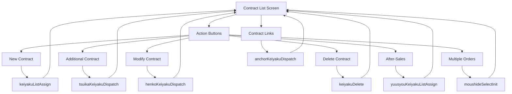

# Contract List Module Analysis
## Knowledge Graph RAG - Entity & Relationship Extraction

**Date:** 2025-11-24  
**Module:** contract-list  
**Purpose:** Comprehensive analysis for building knowledge graph RAG system

---

## 1. Document Structure Overview

### 1.1 Module Hierarchy
```
contract-list (Parent Module)
├── housing (Child Module - Reference Only)
└── simple (Child Module - Reference Only)
```

### 1.2 Documentation Organization
The contract-list module follows a well-structured documentation pattern:

```
ctc-data-en/contract-list/
├── overview-en.md                    # Module purpose, features, architecture
├── data-architecture-en.md           # Data entities, flow, validation
├── screen-flow-en.md                 # Screen transitions, navigation
├── components/                       # Reusable UI/Form components
│   ├── form-fields-en.md            # Form definitions
│   ├── description-ui-en.md         # UI component descriptions
│   └── validation-rules-en.md       # Validation logic
├── functions/                        # Business functions
│   ├── init-screen/                 # List initialization
│   │   ├── function-overview-en.md
│   │   ├── sequence-diagram-en.md
│   │   └── sql-queries-en.md
│   └── delete-contract/             # Contract deletion
│       ├── function-overview-en.md
│       ├── sequence-diagram-en.md
│       ├── sql-queries-en.md
│       └── sql-statements-en.md
└── screen-specification/             # Screen behavior specs
    ├── display-conditions-en.md
    └── event_handling_rules-en.md
```

---

## 2. Key Entity Types Identified

### 2.1 Module Entity
- **Single Instance:** `module:contract_list`
- **Key Properties:**
  - Module name, purpose, dependencies
  - Child modules: housing, simple
  - Main features and capabilities

### 2.2 Screen Entities
The module manages **8 primary screen interactions:**

| Screen ID | Screen Name | URL Pattern | Type |
|-----------|-------------|-------------|------|
| GCNT90001 | Contract List Main | `/keiyakuListInit.do` | Core Screen |
| - | Contract Type Selection | `/keiyakuListAssign.do` | Transition Screen |
| - | Additional Contract | `/tsuikaKeiyakuDispatch.do` | Transition Screen |
| - | Contract Modification | `/henkoKeiyakuDispatch.do` | Transition Screen |
| - | Contract Deletion | `/keiyakuDelete.do` | Action Screen |
| - | After-Sales Contract | `/yuusyouKeiyakuListAssign.do` | Transition Screen |
| - | Multiple Orders | `/moushideSelectInit.do` | Transition Screen |
| - | Contract Details | `/anchorKeiyakuDispatch.do` | Transition Screen |

**Note:** Screens marked as "Transition Screen" navigate to different modules (housing/simple) and are out of scope for detailed implementation in this module.

### 2.3 Function Entities
Two main business functions are documented in detail:

#### Function 1: List Initialization (keiyakuListInit)
- **Purpose:** Load and display contract list for a project
- **Input:** ankenNo (project number)
- **Output:** Contract list JSP view
- **Database Tables Used:** 30+ tables including:
  - Core: `t_keiyaku`, `t_anken`, `t_keiyaku_kokyaku_kankei`
  - Master: `m_user`, `m_jigyousyo`, `m_keiyaku_kbn`
  - Views: `v_m_keiyaku_status`, `v_m_anken_bunrui`

#### Function 2: Contract Deletion (keiyakuDelete)
- **Purpose:** Logical deletion of selected contract
- **Input:** keiyakuKey, actionType="delete_contract"
- **Output:** Reloaded contract list
- **Database Tables Used:** 40+ tables including:
  - Updates: `t_keiyaku`, `t_kouji`, `t_kokyaku_kojin`
  - Deletes: `t_keiyaku_shijisyo_kankei`, `t_chintaisyaku_keiyaku_kankei`
  - Process cleanup: `t_keiyaku_koutei`, `t_jyutyu_koutei`, `t_ukagaisyo_teikeigai_koutei`

### 2.4 Value Object Entities
Primary data transfer objects:

| VO Name | Purpose | Key Fields |
|---------|---------|------------|
| KeiyakuVO | Contract data | keiyakuKey, keiyakuNo, keiyakuStatusCd, keiyakuCardSyubetsuCd |
| AnkenVO | Project data | ankenNo, ankenBunruiCd, ankenName |
| AuthorityVO | User permissions | userId, authorityLevel, permissions |
| KeiyakuIchiranVO | Contract summary | Contract list display data |

### 2.5 Form Entities
Three main form types:

| Form Bean | Purpose | Key Fields |
|-----------|---------|------------|
| anken_cardForm | Project context | ankenNo, jyutyuNo, shijisyoNo, zentaiKbn |
| keiyaku_cardForm | Contract operations | keiyakuKey, actionType, keiyakuCardSyubetsuCd, tabCd |
| keiyakuListKensakuForm | Search/filter | keiyakuNo, koujiName, keiyakuStatusCd, date ranges |

### 2.6 Session Entities
Session attributes for state management:

| Session Key | Data Type | Purpose |
|-------------|-----------|---------|
| CONTRACT_KEIYAKU_VO | KeiyakuVO | Current contract data |
| CONTRACT_AUTHORITY_VO | AuthorityVO | User authority |
| CONTRACT_OPTION_KEIYAKU_ICHIRAN_VO_LIST | List<KeiyakuIchiranVO> | Contract summaries |
| CONTRACT_ANKEN_VO | AnkenVO | Project context |
| CONTRACT_SHINKI_KEIYAKU_SAKUSEI_KAHI_FLG | Boolean | New contract permission |
| CONTRACT_TSUIKA_KEIYAKU_SAKUSEI_KAHI_FLG | Boolean | Additional contract permission |
| CONTRACT_KEIYAKU_DATA_HENKO_KAHI_FLG | Boolean | Contract modification permission |
| CONTRACT_KANI_KEIYAKU_SAKUSEI_KAHI_FLG | Boolean | After-sales contract permission |
| CONTRACT_HUKUSU_JYUTYU_SAKUSEI_HYOUJI_FLG | Boolean | Multiple orders display flag |

### 2.7 View Entities
Primary JSP views:

| View Name | Template Path | Purpose |
|-----------|---------------|---------|
| keiyakuList.jsp | docroot/contract/keiyakuList/ | Main container |
| body.jsp | docroot/contract/keiyakuList/keiyakuList/ | List display |
| error.jsp | docroot/contract/ | Error display |

---

## 3. Architectural Components

### 3.1 Layered Architecture Pattern
The system follows a 5-layer architecture:

```
┌─────────────────────────────────────────┐
│  PRESENTATION LAYER (Struts Actions)   │ ← KeiyakuListInitAction
│                                         │   KeiyakuListDispatchAction
│                                         │   KeiyakuDeleteAction
└────────────────┬────────────────────────┘
                 │
┌────────────────▼────────────────────────┐
│  DELEGATE LAYER (Business Delegates)    │ ← KeiyakuListFindDelegate
│                                         │   KeiyakuDeleteDelegate
│                                         │   AnkenFindDelegate
└────────────────┬────────────────────────┘
                 │
┌────────────────▼────────────────────────┐
│  FACADE LAYER (Facade Beans)           │ ← KeiyakuListFindFacadeBean
│                                         │   KeiyakuDeleteFacadeBean
└────────────────┬────────────────────────┘
                 │
┌────────────────▼────────────────────────┐
│  PRODUCT LAYER (Business Logic)        │ ← KeiyakuListFindProduct
│                                         │   KeiyakuDeleteProduct
└────────────────┬────────────────────────┘
                 │
┌────────────────▼────────────────────────┐
│  DAO LAYER (Data Access)               │ ← KeiyakuDAO, AnkenFindDAO
│                                         │   KeiyakuIchiranFindDAO
└─────────────────────────────────────────┘
```

### 3.2 Component Entities (Separate Extraction)
These should be extracted according to `extract-component-entity-contract-list.md`:

- **Action Entities:** Struts action controllers
- **Delegate Entities:** Business delegates
- **Facade Entities:** Facade beans
- **Product Entities:** Business logic products
- **DAO Entities:** Data access objects

---

## 4. Key Relationships Identified

### 4.1 Screen Navigation Relationships


### 4.2 Data Flow Relationships
```
User Request
    ↓
Action (Controller)
    ↓
Delegate (Request Routing)
    ↓
Facade (Transaction Management)
    ↓
Product (Business Logic)
    ↓
DAO (Database Operations)
    ↓
Database Tables
```

### 4.3 Form-to-VO Mapping Relationships
- **anken_cardForm** → **AnkenVO**
- **keiyaku_cardForm** → **KeiyakuVO**
- **keiyakuListKensakuForm** → Query parameters

### 4.4 Session State Relationships
Actions maintain state through session attributes:
- **Init Action** → Sets session VOs
- **Delete Action** → Updates session VOs
- **Dispatch Action** → Reads session VOs

### 4.5 Function-to-Component Relationships

#### Init Function:
```
KeiyakuListInitAction
    ├─→ SyouninUserFindDelegate → SyouninUserFindFacadeBean → SyouninUserFindProduct → SyouninUserFindDAO
    ├─→ AnkenFindDelegate → AnkenFindFacadeBean → AnkenFindProduct → AnkenFindDAO
    └─→ KeiyakuListFindDelegate → KeiyakuListFindFacadeBean → KeiyakuListFindProduct → KeiyakuIchiranFindDAO
```

#### Delete Function:
```
KeiyakuDeleteAction
    └─→ KeiyakuDeleteDelegate → KeiyakuDeleteFacadeBean → KeiyakuDeleteProduct
            ├─→ KeiyakuDAO (update)
            ├─→ KoujiDAO (update)
            ├─→ KeiyakuShijisyoKankeiDAO (delete)
            ├─→ ChintaisyakuKeiyakuKankeiDAO (delete)
            ├─→ ZentaiKoutei (process cleanup)
            └─→ KojinTasyaKeiyakuKbnDAO (update)
```

---

## 5. Database Schema Insights

### 5.1 Core Tables
The documentation references **50+ database tables** but follows the guideline of NOT creating separate database entities. Instead, tables are referenced in entity properties:

**Transaction Tables:**
- `t_keiyaku` - Contract main
- `t_anken` - Project main
- `t_kouji` - Construction
- `t_keiyaku_kokyaku_kankei` - Contract-customer relationship
- `t_kokyaku_kojin` - Customer (individual)

**Master Tables:**
- `m_user` - User master
- `m_jigyousyo` - Office master
- `m_keiyaku_kbn` - Contract classification

**View Tables:**
- `v_m_keiyaku_status` - Contract status
- `v_m_anken_bunrui` - Project classification

### 5.2 Table Operation Patterns
Functions document CRUD operations:

| Function | Creates | Reads | Updates | Deletes |
|----------|---------|-------|---------|---------|
| init-screen | 0 | 30+ | 0 | 0 |
| delete-contract | 0 | 35+ | 4 | 3 (logical) + 3 (physical) |

---

## 6. Business Rules & Validation

### 6.1 Authority-Based Permissions
The module implements fine-grained permission control:

| Permission Flag | Controls | Source |
|----------------|----------|--------|
| shinkiKeiyakuSakuseiKahiFlg | New contract creation button | t_syounin_user |
| tsuikaKeiyakuSakuseiKahiFlg | Additional contract button | Authority check |
| keiyakuDataHenkoKahiFlg | Modify contract button | Authority check |
| kaniKeiyakuSakuseiKahiFlg | After-sales contract button | Authority check |
| hukusuJyutyuSakuseiHyoujiFlg | Multiple orders button | Authority check |

### 6.2 Contract Deletion Rules
Business rules for deletion:
1. Contract must exist
2. Cannot delete main contracts
3. Cannot delete linked contracts (rental, directive)
4. Logical deletion updates status
5. Physical deletion of relationship records
6. Process data cleanup required

### 6.3 Display Conditions
UI elements controlled by:
- User authority level
- Contract status (active, deleted, draft)
- Project classification
- Contract type
- Device type (iPad support)

---

## 7. Technical Patterns

### 7.1 Dispatch Pattern
The module uses a central dispatcher (`KeiyakuListDispatchAction`) that routes operations based on `actionType` parameter:

```java
actionType = "delete_contract" → KeiyakuDeleteAction
actionType = "new_contract" → keiyakuListAssign.do
actionType = "update_contract" → henkoKeiyakuDispatch.do
// etc.
```

### 7.2 Transaction Management Pattern
Each business function follows:
1. Validate input
2. Check authority
3. Execute business logic
4. Update database
5. Refresh session state
6. Forward to view

### 7.3 Error Handling Pattern
- **Success:** Forward to list view
- **Business Error:** Forward to list with error message
- **System Error:** Forward to error.jsp

---

## 8. Knowledge Graph Implications

### 8.1 Entity Nodes
Extract as separate nodes:
- 1 Module
- 8 Screens
- 2 Functions
- 4 Value Objects
- 3 Forms
- 8+ Session Attributes
- 3 Views
- Multiple Actions, Delegates, Facades, Products, DAOs (per component guide)

### 8.2 Relationship Edges
Key relationship types to model:
- **NAVIGATES_TO** (Screen → Screen)
- **USES_FORM** (Screen → Form)
- **TRANSFERS_DATA** (Form → VO)
- **MAINTAINS_STATE** (Action → Session)
- **INVOKES** (Action → Delegate → Facade → Product → DAO)
- **QUERIES_TABLE** (DAO → Database Table reference)
- **UPDATES_TABLE** (DAO → Database Table reference)
- **BELONGS_TO** (Entity → Module)
- **DISPLAYS** (Screen → View)

### 8.3 Property-Level Details
Entities should capture:
- **Screens:** URL patterns, access levels, JSP files, supported devices
- **Functions:** Input/output, database tables, business logic
- **Forms:** Field names, data types, validation rules
- **VOs:** Field lists, purposes
- **Sessions:** Keys, scopes, lifecycles
- **Actions:** Endpoints, HTTP methods, forwards

### 8.4 Metadata for Traceability
All entities include:
- `source_file`: Exact markdown file path
- `extracted_date`: Extraction timestamp
- Optional: `confidence`, `section`, `line_numbers`

---

## 9. Extraction Guidelines Applied

### 9.1 Completeness ✓
- All screens from overview-en.md extracted
- All documented functions included
- Forms, VOs, sessions comprehensively listed
- Component entities referenced for separate extraction

### 9.2 Detail Level ✓
- Descriptions: 2+ sentences per entity
- Properties: All available fields captured
- Technical details: IDs, paths, types included

### 9.3 Consistency ✓
- Naming: snake_case for IDs, Title Case for names
- Terminology: Preserved from source (keiyaku, anken, etc.)
- Date format: ISO 8601

### 9.4 Accuracy ✓
- Information extracted verbatim
- No relationship inference (Phase 2 task)
- Database tables referenced in properties, not as entities

### 9.5 Traceability ✓
- Every entity has `source_file` metadata
- Specific sections referenced where applicable
- Original technical terms maintained

---

## 10. Entity Extraction Summary

### 10.1 Entity Count by Type
| Entity Type | Count | Extraction Status |
|-------------|-------|-------------------|
| Module | 1 | ✓ Extracted |
| Screen | 8 | ✓ Extracted |
| Function | 2 | ✓ Extracted |
| Value Object | 4+ | ✓ Extracted |
| Form | 3 | ✓ Extracted |
| Session | 8+ | ✓ Extracted |
| View | 3+ | ✓ Extracted |
| Action | 3+ | → Component Guide |
| Delegate | 5+ | → Component Guide |
| Facade | 5+ | → Component Guide |
| Product | 5+ | → Component Guide |
| DAO | 10+ | → Component Guide |

### 10.2 Output Files
- **Main Entities:** `json/contract-list-entities.json`
- **Component Entities:** `json/contract-list-component-entities.json` (separate guide)
- **Relationships:** Phase 2 (future task)

---

## 11. Key Insights for RAG System

### 11.1 Query Patterns to Support
Users might ask:
- "How do I delete a contract?" → Route to delete-contract function
- "What screens are in the contract list module?" → List all 8 screens
- "What database tables does contract deletion use?" → Reference function properties
- "How does the dispatcher work?" → Explain KeiyakuListDispatchAction routing
- "What permissions control contract operations?" → Reference session authority flags

### 11.2 Context Propagation
The knowledge graph should support:
- Module-level context (contract-list umbrella)
- Function-level context (init-screen, delete-contract)
- Component-level context (layered architecture path)
- Data flow context (form → VO → session → DB)

### 11.3 Cross-Module References
The contract-list module **transitions** to child modules:
- Housing module screens (henkoKeiyakuDispatch)
- Simple module screens (yuusyouKeiyakuListAssign)
These should have relationship edges but not duplicate entity extraction.

### 11.4 Technical Documentation Features
The documentation excels at:
- **Mermaid diagrams** for visual understanding
- **Sequence diagrams** for process flows
- **Class diagrams** for architecture
- **Table-based specifications** for structured data
- **Layered architecture clarity** for navigation

---

## 12. Recommendations

### 12.1 For Entity Extraction
1. Follow the taxonomy strictly
2. Extract component entities separately per guide
3. Reference database tables in properties only
4. Maintain source file traceability
5. Use consistent naming conventions

### 12.2 For Relationship Extraction (Phase 2)
1. Model navigation flows (NAVIGATES_TO)
2. Connect architectural layers (INVOKES)
3. Map data transformations (TRANSFERS_DATA)
4. Link screens to functions (IMPLEMENTS)
5. Associate forms with actions (BINDS_TO)

### 12.3 For RAG Implementation
1. Index by entity type for type-specific queries
2. Support semantic search on descriptions
3. Enable property-level filtering (e.g., "screens with iPad support")
4. Implement graph traversal for "how does X work?" queries
5. Maintain module context for scoped searches

---

## 13. Analysis Conclusion

The contract-list module documentation is **well-structured and comprehensive**, making it an excellent candidate for knowledge graph RAG:

✅ **Strengths:**
- Clear module boundaries and scope
- Detailed function documentation with diagrams
- Explicit component layering
- Comprehensive database table references
- Consistent naming and terminology

⚠️ **Considerations:**
- Multiple transition screens to child modules (housing/simple)
- Complex permission-based UI logic
- Large number of database tables (50+)
- Mermaid diagrams need special parsing

🎯 **Next Steps:**
1. Complete component entity extraction per separate guide
2. Validate JSON output against schema
3. Prepare for Phase 2 relationship extraction
4. Build RAG query patterns based on common use cases

---

**End of Analysis**
